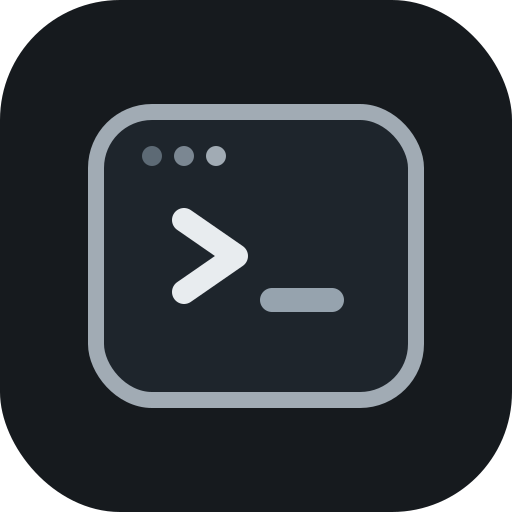

<div align="center">
  
  <h1>command-lib</h1>
  <p><strong>Annotation-driven commands for Paper plugins.</strong></p>
  <p>Runtime registration, typed arguments, subcommands, and async tab completion without large <code>plugin.yml</code> command sections.</p>
</div>

<p align="center">
  <a href="https://github.com/thelipe7/command-lib/wiki">📚 Wiki</a>
  ·
  <a href="https://github.com/thelipe7/command-lib/issues">🐛 Issues</a>
  ·
  <a href="https://github.com/thelipe7/command-lib/blob/main/LICENSE">📄 License</a>
</p>

## ✨ Highlights

- Annotation-based command classes
- Runtime registration through Bukkit's `CommandMap`
- Default handlers, subcommands, and unknown fallbacks
- Built-in argument resolvers for common Paper and Bukkit types
- Async tab completion support on Paper
- Custom argument resolvers and custom tab completers
- Optional and joined arguments

## ✅ Requirements

- Java 21
- Paper `1.21.11`

Other Bukkit-compatible servers or versions may work, but the current codebase targets and documents Paper `1.21.11`.

## 📦 Installation

### Gradle Kotlin DSL

```kotlin
repositories {
    mavenCentral()
    maven("https://jitpack.io")
}

dependencies {
    implementation("com.github.thelipe7:command-lib:TAG")
}
```

### Gradle Groovy DSL

```groovy
repositories {
    mavenCentral()
    maven { url = 'https://jitpack.io' }
}

dependencies {
    implementation 'com.github.thelipe7:command-lib:TAG'
}
```

### Maven

```xml
<repositories>
    <repository>
        <id>jitpack.io</id>
        <url>https://jitpack.io</url>
    </repository>
</repositories>

<dependencies>
    <dependency>
        <groupId>com.github.thelipe7</groupId>
        <artifactId>command-lib</artifactId>
        <version>TAG</version>
    </dependency>
</dependencies>
```

Replace `TAG` with a Git tag, release version, or commit hash from this repository.

## 🚀 Quick Start

Create the manager in your plugin:

```java
public final class ExamplePlugin extends JavaPlugin {

    @Override
    public void onEnable() {
        CommandManager manager = new CommandManager(this, true);
        manager.registerCommand(new WarpCommand());
    }

}
```

Then create a command class:

```java
import net.thelipe.command.CustomCommand;
import net.thelipe.command.annotation.Command;
import net.thelipe.command.annotation.Default;
import net.thelipe.command.annotation.Name;
import net.thelipe.command.annotation.Permission;
import net.thelipe.command.annotation.SubCommand;
import net.thelipe.command.annotation.TabComplete;
import net.thelipe.command.annotation.Unknown;
import org.bukkit.command.CommandSender;
import org.bukkit.entity.Player;

@Command({"warp", "warps"})
@Permission("example.warp")
public final class WarpCommand extends CustomCommand {

    @Default
    public void defaultCommand(CommandSender sender) {
        sender.sendMessage("Use /warp teleport <player>");
    }

    @SubCommand("teleport")
    @Permission("example.warp.teleport")
    @TabComplete("@players")
    public void teleport(CommandSender sender, @Name("player") Player target) {
        sender.sendMessage("Teleport target: " + target.getName());
    }

    @Unknown(true)
    public void unknown(CommandSender sender) {
        sender.sendMessage("Unknown subcommand.");
    }

}
```

## 🧭 Documentation

The README is intentionally compact. Full documentation lives in the wiki.

- [📚 Wiki Home](https://github.com/thelipe7/command-lib/wiki)
- [⚙️ Installation](https://github.com/thelipe7/command-lib/wiki/Installation)
- [🚀 Getting Started](https://github.com/thelipe7/command-lib/wiki/Getting-Started)
- [🧩 Defining Commands](https://github.com/thelipe7/command-lib/wiki/Defining-Commands)
- [🔎 Arguments and Resolvers](https://github.com/thelipe7/command-lib/wiki/Arguments-and-Resolvers)
- [⌨️ Tab Completion](https://github.com/thelipe7/command-lib/wiki/Tab-Completion)
- [🔐 Permissions and Messages](https://github.com/thelipe7/command-lib/wiki/Permissions-and-Messages)
- [🧪 API Reference](https://github.com/thelipe7/command-lib/wiki/API-Reference)
- [🛠️ Troubleshooting](https://github.com/thelipe7/command-lib/wiki/Troubleshooting)

## 🧠 Built-In Support

Built-in argument resolvers include:

- `String`
- numeric primitives and wrappers
- `boolean`
- `Duration`
- `Player`
- enums
- `Enchantment`
- `ItemStack`
- `GameMode`

Built-in tab completion support includes:

- `Player`
- `boolean`
- `Duration`
- enums
- `Enchantment`
- `ItemStack`

For implementation details and extension examples, use the wiki:

- [Arguments and Resolvers](https://github.com/thelipe7/command-lib/wiki/Arguments-and-Resolvers)
- [Tab Completion](https://github.com/thelipe7/command-lib/wiki/Tab-Completion)
- [API Reference](https://github.com/thelipe7/command-lib/wiki/API-Reference)

## 🏗️ Real-World Usage

The library is already being used in larger plugin codebases with:

- custom argument resolvers for domain objects
- project-specific tab completers
- class-level and method-level permission structures
- manual unknown/help output handlers

That usage pattern is reflected throughout the wiki documentation.

## 🆘 Support

Use the issue templates for:

- `Bug Report` for bugs, incompatibilities, and regressions
- `Feature Request` for improvements and new ideas
- `Question` for usage and integration questions

Before opening an issue, check the wiki:

- [Wiki Home](https://github.com/thelipe7/command-lib/wiki)
- [Troubleshooting](https://github.com/thelipe7/command-lib/wiki/Troubleshooting)

## 🤝 Contributing

Issues and pull requests are welcome.

If you change public behavior, update the relevant wiki page together with the code.

## 📄 License

This project is licensed under the Apache License 2.0. See [LICENSE](https://github.com/thelipe7/command-lib/blob/main/LICENSE) for details.
